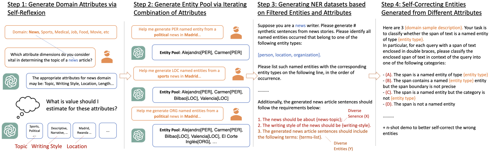

# ProgGen
This repo contains the code and datasets for paper "ProgGen: Generating Named Entity Recognition Datasets Step-by-step with Self-Reflexive Large Language Models". 





We study 4 datasets: CoNLL-2003, WikiGold, MIT-Movie and MIT-Restaurant. 

See `data` for LLM prompts and responses and processed datasets and `commands` for reproducing the results in the main experiments. 


## Data

The `reproduce` folder contains prompts, LLM responses and processed datasets as reported in our main experiments. It is organized as follows: 

-   `diversify-x` (Diversify X) 
    -   `gen-attr-dim` and `gen-attr-val` contain prompts and responses for attribute dimensions and attribute values generation, respectively. 
    -   `config` contains processed attribute dimensions and values. 
-   `diversify-y` (Diversify X)
    -   `gen-entity-vanilla` and `gen-entity-latent`contain prompts and responses for named entity pool generation, for the vanilla and latent variant, respectively. 
    -   `config` contains processed named entities. 
-   `sample` for NER sample generation 
    -   `gen-sample` contains prompts and responses. 
    -   `dataset` contains processed NER datasets. 
-   `correction` for LLM self-correction 
    -   `gen-correction` contains prompts and responses. 
    -   `config` contains entity-class-specific annotation instructions and demos for each dataset and each diversity approach. 
    -   `instruction&demo-pool` contains annotation instruction pool and demo pool for each entity class, shared for all diversity approaches, for illustration purposes. 
    -   `annotation-error` contains representative entity annotation errors from NER sample generation for each dataset. 
    -   `dataset` contains processed datasets with entity annotations overridden by processed corrections. 


Note 

-   LLM prompts and responses are available in 2 formats: 
    1.   A readable format, via `prompts.log` and `completion-*.txt` files, and
    2.   OpenAI API format, via `requests.jsonl` and `requests_results.jsonl` files. 
-   All folders are have date prefixes indicating date of experiments. 
-   In each processed dataset (`sample/dataset`) folder, each entity annotation triple (sentence, span, entity type) is  available in `logprobs-triple.json` files. 
-   Top-uncertain triples selected for LLM Self-Correction are available from correction generation log files (`correction/gen-correction/**/completion.log`)


## Commands

We detail scripts for running experiments and reproducing our results with example commands. 

Note 

1.   Each script contains all relevant arguments (see `help` in each script and `utils.py`). 
2.   It’s expected to run each script/command at the directory root level. 
3.   Terminal logging messages (and log file writes) w.r.t each script will show where the relevant (dataset) files are saved. 
4.   All OpenAI API responses and processed datasets will be written to the `generated_data` folder. 


Before you run a script, make sure python sees the `src` package folder: 

```bash
export PYTHONPATH=$PYTHONPATH:$(pwd) 
```

For all LLM generation steps, set your OpenAI API via 

```bash
export OPENAI_API_KEY='<your-api-key>'
```


### Environment Setup

Python version `3.8`

1> Install conda environment 

```bash
conda create -n prog-gen python=3.8 pip
```

2> Activate environment and install packages

```bash
conda activate prog-gen
pip install -r requirements.txt
```


### Steps

#### Step 1: Write Original Dataset Samples

Includes writing (1) few-shot demo samples and (2) entire test set for each of the datasets studied. Intended for downstream model training. 

See `write_original_dataset.py` for details. 


Example 1: Write few-shot demo samples for CoNLL-2003:

```bash
python scripts/write_original_dataset.py demo \
	--dataset_name 'conll2003-no-misc' \
	--n_demo 1 \
	--include_negative_sample 1
```

Example 2: Write entire test set for MIT-Movie:

```bash
python scripts/write_original_dataset.py test --dataset_name 'mit-movie'
```


Note this step is not necessary as each subsequent step will automatically write the respective files if not found. 


#### Step 2: Generate Diversify Requirement Configurations

Note that additional manual inspection and filtering for low-quality values may be needed. 


**1: Diversify X** 

Note we omit the step for attribute dimension generation as we queried the GPT-4 web App. See the paper for the prompt templates and `reproduce` for the actual prompts used. 


See `generate_diversify_x_config.py` for details on generating attribute values. 

Example on WikiGold: 

```bash
python scripts/generate_diversity_config.py \
	--dataset_name 'wiki-gold-no-misc' \
	--diversity_variant 'diversify-x' \
	--prompt_seed 42 \
	--chat_model_name 'gpt-3.5-turbo-1106' \
	--chat_timeout 30 \
	--n_call 3
```


**2: Diversify Y**

Includes the *vanilla* and *latent* variants. See `generate_diversify_y_config.py`


Example 1: The *vanilla* variant on MIT-Restaurant: 

```bash
python scripts/generate_diversity_config.py \
	--dataset_name 'mit-restaurant' \
	--diversity_variant 'diversify-y-vanilla' \
	--prompt_seed 42 \
	--chat_model_name 'gpt-3.5-turbo-1106' \
	--chat_timeout 30 \
	--n_call 10
```


Example 2: The *latent* variant on  CoNLL-2003: 

```bash
python scripts/generate_diversity_config.py \
	--dataset_name 'conll2003-no-misc' \
	--diversity_variant 'diversify-y-latent' \
	--diversify_y_latent_attribute 'reproduce/diversify-x/config/conll2003_no_misc.json' \
	--prompt_seed 42 \
	--chat_model_name 'gpt-3.5-turbo-1106' \
	--chat_max_tokens 256 \
	--chat_timeout 30 \
	--n_call 5
```


Note the internal name of the dataset-independent attribute dimension for each dataset is given by 

```python
DATASET_NAME2TOPIC_DIM = {
    'conll2003-no-misc': 'news-category',
    'wiki-gold-no-misc': 'topic',
    'mit-movie': 'query-category',
    'mit-restaurant': 'meal-category'
}
```


#### Step 3: Generate NER Samples

Includes Simple Prompt and all 4 diversity variants studied. 

See `generate_ner_sample.py` for details. 


Example 1: Simple Prompt on MIT-Movie: 

```bash
python scripts/generate_ner_sample.py \
	--dataset_name 'mit-movie' \
	--diversity_variant 'simple-prompt' \
	--prompt_seed 42 \
	--n_list 50 \
	--n_call 36 \
	--chat_model_name 'gpt-3.5-turbo-1106' \
	--chat_max_tokens 2560 \
	--chat_logprobs 'True' \
	--chat_timeout 60
```

Note (1) a large `n_list` (e.g. 50) may not yield 50 generated samples sometimes, as discussed in the paper, and (2) WikiGold generated samples are much longer so a relatively higher `chat_max_tokens` is advised. 


Example 2: Diversify X on WikiGold: 

```bash
python scripts/generate_ner_sample.py \
	--dataset_name 'wiki-gold-no-misc' \
	--diversity_variant 'diversify-x' \
	--diversify_x_config 'reproduce/diversify-x/config/wiki_gold_no_misc.json' \
	--prompt_seed 42 \
	--n_list 3 \
	--n_call 600 \
	--chat_model_name 'gpt-3.5-turbo-1106' \
	--chat_max_tokens 256 \
	--chat_logprobs 'True' \
	--chat_timeout 20
```


Example 3: Diversify Y (vanilla) on MIT-Restaurant: 

```bash
python scripts/generate_ner_sample.py \
	--dataset_name 'mit-restaurant' \
	--diversity_variant 'diversify-y-vanilla' \
	--diversify_y_config 'reproduce/diversify-y/config/vanilla/mit_restaurant.json' \
	--prompt_seed 42 \
	--n_list 3 \
	--n_call 600 \
	--chat_model_name 'gpt-3.5-turbo-1106' \
	--chat_max_tokens 256 \
	--chat_logprobs 'True' \
	--chat_timeout 20
```


Example 4: Diversify Y (latent) on MIT-Movie: 

```bash
python scripts/generate_ner_sample.py \
	--dataset_name 'mit-movie' \
	--diversity_variant 'diversify-y-latent' \
	--diversify_y_config 'reproduce/diversify-y/config/latent/mit_movie.json' \
	--diversify_y_n_exp_entity 4.5 \
	--prompt_seed 42 \
	--n_list 3 \
	--n_call 600 \
	--chat_model_name 'gpt-3.5-turbo-1106' \
	--chat_max_tokens 256 \
	--chat_logprobs 'True' \
	--chat_timeout 20
```


Example 5: Diversify X+Y on CoNLL-2003: 

```bash
python scripts/generate_ner_sample.py \
	--dataset_name 'conll2003-no-misc' \
	--diversity_variant 'diversify-x+y' \
	--diversify_x_config 'reproduce/diversify-x/config/conll2003_no_misc.json' \
	--diversify_y_config 'reproduce/diversify-y/config/latent/conll2003_no_misc.json' \
	--prompt_seed 42 \
	--n_list 3 \
	--n_call 600 \
	--chat_model_name 'gpt-3.5-turbo-1106' \
	--chat_max_tokens 256 \
	--chat_logprobs 'True' \
	--chat_timeout 20
```

Diversity arguments including `diversify_x_config`, `diversify_x_sample_prob`  `diversify_y_config` and `diversify_y_n_exp_entity` are optional and will default to setups as reported in the paper (via loading from processed datasets in the `generated_data` folder). 


#### Step 4: Generate LLM Self-Corrections

For generating LLM Self-Corrections for entity annotations given a generated (and processed) NER dataset. 

See `generate_correction.py`


Example: Self-Correction for a processed dataset (`diversify-y-vanilla`) on MIT-Movie 

```bash
python scripts/generate_correction.py \
	--dataset_name 'mit-movie' \
	--generated_dataset_dir_name 'reproduce/sample/dataset/mit_movie/24-02-06_Diversify-Y-vanilla' \
	--correction_config 'reproduce/correction/config/mit_movie/Diverse-Y-vanilla.json' \
	--output_postfix 'diversify-y-vanilla' \
	--prompt_seed 42 \
	--n_correct 3 \
	--logprob_thresh=-2e-2 \
	--top_n 0.2 \
	--chat_model_name 'gpt-3.5-turbo-1106' \
	--chat_max_tokens 256 \
	--chat_temperature 0 \
	--chat_timeout 30
```


#### Step 5: Downstream BERT Training

Includes training a BERT-class model with epoch-wise evaluation. See `train.py`. 


Example: Train a generated dataset (Diversify X) with self-correction for WikiGold: 

```bash
python scripts/train.py \
	--dataset_name 'wiki-gold-no-misc' \
	--generated_dataset_dir_name 'reproduce/correction/dataset/wiki_gold_no_misc/24-02-11_Diversify-X' \
	--few_shot_demo_file 'bio-train-1-shot-shuffled+neg.jsonl' \
	--test_file 'bio-test-all.jsonl' \
	--hf_model_name 'microsoft/deberta-v3-base' \
	--learning_rate 4e-5 \
	--n_epochs 16.0 \
	--train_batch_size 24 \
	--seed 42
```

To train with GPU, use: 

```bash
CUDA_VISIBLE_DEVICES=<your-gpu-id> python scripts/train.py ...
```


### Potential Support

Potential functionalities to support include 

1.   Custom shuffle seed for different set of n-shot demo 
2.   Customizable templates, including
     -   (1) diversity config generation, (2) data generation instruction and (3) diversity requirement

